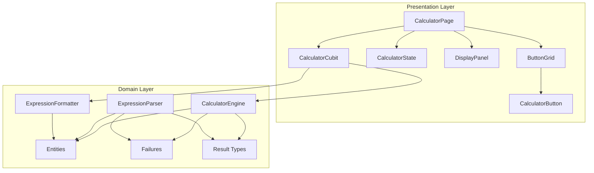
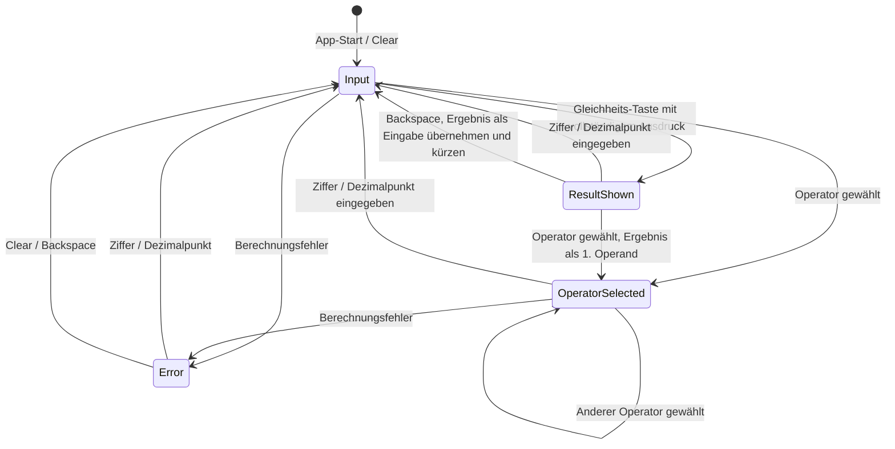

# Design-Dokument: Calculator App

## Übersicht

Dieses Design beschreibt die technische Umsetzung einer Taschenrechner-App als Flutter-Anwendung mit Clean Architecture. Die App ersetzt das bestehende Counter-Template und bietet grundlegende arithmetische Operationen (Addition, Subtraktion, Multiplikation, Division) mit einer responsiven Benutzeroberfläche.

Die Architektur folgt dem Prinzip der Schichtentrennung mit zwei aktiven Schichten:

- **Domain Layer**: fachliche Modelle, Berechnungslogik, Parser, Formatter und Fehlerobjekte
- **Presentation Layer**: Flutter-UI, Widgets und Cubit-basierte Zustandsverwaltung

Ein Data-Layer ist für diese App nicht erforderlich, da keine Persistenz, keine API und keine externe Datenquelle verwendet werden.

Als State-Management-Lösung wird **Cubit (`flutter_bloc`)** eingesetzt. Cubit ist für diesen Anwendungsfall leichtgewichtig, gut testbar und passt zu einer klaren, immutable State-Struktur.

## Zentrale Design-Entscheidungen

| Entscheidung | Wahl | Begründung |
|---|---|---|
| State Management | Cubit (`flutter_bloc`) | Leichtgewichtig, testbar, ausreichend für die überschaubare State-Machine der App |
| Value Equality | `equatable` | Keine Code-Generierung nötig, ausreichend für State- und Entity-Vergleiche |
| Dezimalzahlen | `decimal` Package | Vermeidet Floating-Point-Artefakte wie `0.1 + 0.2` und unterstützt stabile Formatierung und Round-Trips |
| Fehlerbehandlung | Eigenes Result-/Failure-Modell | Explizite, typsichere Fehlerbehandlung ohne unbehandelte Exceptions und ohne schwere funktionale Abhängigkeit |
| Layout-Strategie | `LayoutBuilder` + `OrientationBuilder` | Native Flutter-Lösung für responsives Layout in Hoch- und Querformat |
| Parser-Nutzung | Domain-Komponente, nicht primär UI-Steuerung | Parser/Formatter dienen der Expression-Konvertierung und Testbarkeit; die Button-UI arbeitet zustandsbasiert |

## Architektur



### Dependency Rule

- **Presentation → Domain**: `CalculatorCubit` und UI-Komposition dürfen Domain-Klassen importieren.
- **Domain → keine äußeren Schichten**: Domain-Klassen haben keine Abhängigkeit zu Flutter, Presentation oder Data.
- **Kein Data-Layer**: Es gibt keine Persistenz oder externe Datenquelle.
- **Widgets bleiben passiv**: Widgets rufen keine Domain-Use-Cases direkt auf. Sie erhalten Daten und Callbacks von `CalculatorPage` bzw. `CalculatorCubit`.

## Verzeichnisstruktur

```text
lib/
├── main.dart
├── core/
│   ├── constants/
│   │   └── app_constants.dart
│   └── result/
│       └── result.dart
└── features/
    └── calculator/
        ├── domain/
        │   ├── entities/
        │   │   ├── calculation_expression.dart
        │   │   └── operator_type.dart
        │   ├── failures/
        │   │   ├── calculation_failure.dart
        │   │   └── parse_failure.dart
        │   └── usecases/
        │       ├── calculator_engine.dart
        │       ├── expression_parser.dart
        │       └── expression_formatter.dart
        └── presentation/
            ├── cubit/
            │   ├── calculator_cubit.dart
            │   ├── calculator_state.dart
            │   └── calculator_status.dart
            ├── pages/
            │   └── calculator_page.dart
            └── widgets/
                ├── calculator_button.dart
                ├── button_grid.dart
                └── display_panel.dart
```

## Domain Layer

### OperatorType

```dart
enum OperatorType {
  addition,
  subtraction,
  multiplication,
  division,
}
```

Hilfsmethoden können als Extension umgesetzt werden:

```dart
extension OperatorTypeSymbol on OperatorType {
  String get symbol => switch (this) {
    OperatorType.addition => '+',
    OperatorType.subtraction => '−',
    OperatorType.multiplication => '×',
    OperatorType.division => '÷',
  };
}
```

### CalculationExpression

```dart
class CalculationExpression extends Equatable {
  final Decimal firstOperand;
  final OperatorType operator;
  final Decimal secondOperand;

  const CalculationExpression({
    required this.firstOperand,
    required this.operator,
    required this.secondOperand,
  });

  @override
  List<Object?> get props => [firstOperand, operator, secondOperand];
}
```

### CalculationFailure

```dart
enum CalculationFailureType {
  divisionByZero,
  overflow,
}

class CalculationFailure extends Equatable {
  final CalculationFailureType type;

  const CalculationFailure(this.type);

  @override
  List<Object?> get props => [type];
}
```

### ParseFailure

```dart
enum ParseFailureType {
  missingOperand,
  missingOperator,
  invalidCharacter,
  operandTooLong,
}

class ParseFailure extends Equatable {
  final ParseFailureType type;

  const ParseFailure(this.type);

  @override
  List<Object?> get props => [type];
}
```

### Result-Typen

Für die Domain wird ein leichtes Result-Modell verwendet. Dadurch ist die Fehlerbehandlung explizit, ohne dass `dartz` notwendig ist.

```dart
sealed class CalculationResult extends Equatable {
  const CalculationResult();
}

class CalculationSuccess extends CalculationResult {
  final Decimal value;

  const CalculationSuccess(this.value);

  @override
  List<Object?> get props => [value];
}

class CalculationError extends CalculationResult {
  final CalculationFailure failure;

  const CalculationError(this.failure);

  @override
  List<Object?> get props => [failure];
}
```

```dart
sealed class ParseResult extends Equatable {
  const ParseResult();
}

class ParseSuccess extends ParseResult {
  final CalculationExpression expression;

  const ParseSuccess(this.expression);

  @override
  List<Object?> get props => [expression];
}

class ParseError extends ParseResult {
  final ParseFailure failure;

  const ParseError(this.failure);

  @override
  List<Object?> get props => [failure];
}
```

## Domain Use Cases

### CalculatorEngine

```dart
class CalculatorEngine {
  CalculationResult calculate(CalculationExpression expression);
}
```

Verhalten:

- Addition, Subtraktion und Multiplikation werden direkt mit `Decimal` berechnet.
- Division prüft zuerst, ob der zweite Operand `0` ist.
- Division durch Null gibt `CalculationError(CalculationFailure(divisionByZero))` zurück.
- Ergebnisse, die außerhalb des unterstützten Ergebnisbereichs liegen, geben `CalculationError(CalculationFailure(overflow))` zurück.
- Die Domain gibt niemals den UI-Text `"Fehler"` zurück.

### Numerischer Bereich

Der unterstützte Operandbereich ist:

```text
-999999999999 bis 999999999999
```

Der unterstützte Ergebnisbereich ist identisch mit dem Operandbereich. Ein Ergebnis außerhalb dieses Bereichs führt zu `CalculationFailureType.overflow`.

Die Anzeige ist davon getrennt: Der Formatter stellt gültige Ergebnisse mit maximal 12 sichtbaren Ziffern dar. Dezimalpunkt und Minuszeichen zählen nicht als Ziffern.

### ExpressionParser

```dart
class ExpressionParser {
  ParseResult parse(String input);
}
```

Verhalten:

- Erwartet Ausdrücke im Format `{Operand1} {Operator} {Operand2}`.
- Unterstützte Operator-Symbole: `+`, `−`, `×`, `÷`.
- Jeder Operand darf maximal 12 sichtbare Ziffern enthalten.
- Dezimalpunkt und Minuszeichen zählen nicht als sichtbare Ziffern.
- Ungültige Eingaben geben einen spezifischen `ParseFailure` zurück.

### ExpressionFormatter

```dart
class ExpressionFormatter {
  String formatExpression(CalculationExpression expression);
  String formatNumber(Decimal value);
}
```

Verhalten:

- `formatExpression` gibt `{Operand1} {Operator} {Operand2}` zurück.
- `formatNumber` entfernt unnötige führende Nullen.
- `formatNumber` erhält `0` vor Dezimalzahlen kleiner als `1`, z. B. `0.5`.
- `formatNumber` entfernt unnötige nachgestellte Nullen nach dem Dezimalpunkt.
- `formatNumber` stellt maximal 12 sichtbare Ziffern dar.
- Falls Rundung nötig ist, wird auf maximal 12 signifikante sichtbare Ziffern gerundet.

## Presentation Layer

### CalculatorStatus

```dart
enum CalculatorStatus {
  input,
  operatorSelected,
  resultShown,
  error,
}
```

### CalculatorState

```dart
class CalculatorState extends Equatable {
  final String currentInput;
  final OperatorType? selectedOperator;
  final Decimal? firstOperand;
  final Decimal? result;
  final CalculatorStatus status;

  const CalculatorState({
    this.currentInput = '0',
    this.selectedOperator,
    this.firstOperand,
    this.result,
    this.status = CalculatorStatus.input,
  });

  static const initial = CalculatorState();

  CalculatorState copyWith({
    String? currentInput,
    OperatorType? selectedOperator,
    bool clearSelectedOperator = false,
    Decimal? firstOperand,
    bool clearFirstOperand = false,
    Decimal? result,
    bool clearResult = false,
    CalculatorStatus? status,
  });

  @override
  List<Object?> get props => [
        currentInput,
        selectedOperator,
        firstOperand,
        result,
        status,
      ];
}
```

Hinweis: Für nullable Felder verwendet `copyWith` explizite Clear-Flags, damit zwischen „nicht ändern“ und „auf null setzen“ unterschieden werden kann.

### Abgeleitete Anzeigeinformationen

`CalculatorState` speichert keinen separaten `expressionText`. Dieser wird in `CalculatorPage` oder in einer kleinen Presentation-Hilfsmethode aus dem State abgeleitet. Dadurch wird doppelter, potenziell inkonsistenter UI-State vermieden.

Beispielhafte Ableitung:

- `status == error` → Hauptanzeige: `Fehler`
- `status == resultShown` und `result != null` → Hauptanzeige: formatiertes Ergebnis
- sonst → Hauptanzeige: `currentInput`
- `firstOperand != null && selectedOperator != null` → Nebenanzeige: `{firstOperand} {operator}`

### CalculatorCubit

```dart
class CalculatorCubit extends Cubit<CalculatorState> {
  final CalculatorEngine _engine;
  final ExpressionFormatter _formatter;

  CalculatorCubit({
    required CalculatorEngine engine,
    required ExpressionFormatter formatter,
  })  : _engine = engine,
        _formatter = formatter,
        super(CalculatorState.initial);

  void inputDigit(String digit);
  void inputDecimalPoint();
  void selectOperator(OperatorType operator);
  void calculate();
  void clear();
  void backspace();
}
```

Der `ExpressionParser` wird nicht vom Cubit für die normale Button-Bedienung benötigt. Er bleibt eine Domain-Komponente für das Parsen formatierter Ausdrücke und wird separat getestet.

## Zustandsübergänge



### Explizite Edge-Case-Regeln

- `calculate()` ohne `selectedOperator` oder ohne `firstOperand` bleibt ohne Effekt.
- `calculate()` im Status `operatorSelected` bleibt ohne Effekt, solange kein zweiter Operand eingegeben wurde.
- `selectOperator()` im Initialzustand mit `currentInput = "0"` setzt `firstOperand = 0` und `status = operatorSelected`.
- `selectOperator()` im Status `operatorSelected` ersetzt den aktiven Operator, ohne `firstOperand` zu ändern.
- `selectOperator()` im Status `resultShown` übernimmt das Ergebnis als `firstOperand`.
- `inputDigit()` im Status `resultShown` startet eine neue Berechnung mit der eingegebenen Ziffer.
- `inputDecimalPoint()` im Status `resultShown` startet eine neue Berechnung mit `0.`.
- `inputDigit()` oder `inputDecimalPoint()` im Status `error` startet eine neue Berechnung.
- `backspace()` im Status `error` setzt den State auf `CalculatorState.initial`.
- `backspace()` im Status `resultShown` übernimmt das formatierte Ergebnis als `currentInput` und entfernt das letzte Zeichen.
- Wenn nach `backspace()` keine Zeichen übrig bleiben, wird `currentInput` auf `0` gesetzt.
- Operationen werden sequenziell von links nach rechts ausgewertet. Es gibt keine Operatorpräzedenz.

## UI-Komponenten

### CalculatorPage

Verantwortlich für:

- Bereitstellung des `CalculatorCubit` via `BlocProvider`
- Layout-Entscheidung via `LayoutBuilder` und `OrientationBuilder`
- Zusammensetzung von `DisplayPanel` und `ButtonGrid`
- Ableitung von `displayText` und `expressionText` aus `CalculatorState`

### DisplayPanel

```dart
class DisplayPanel extends StatelessWidget {
  final String displayText;
  final String? expressionText;

  const DisplayPanel({
    required this.displayText,
    this.expressionText,
    super.key,
  });
}
```

Verhalten:

- Zeigt `displayText` als Hauptanzeige.
- Zeigt `expressionText` optional als kleinere Nebenanzeige.
- Muss unabhängig in Widget-Tests instanziierbar sein.
- Darf keinen Cubit und keine Domain-Use-Cases direkt kennen.

### ButtonGrid

```dart
class ButtonGrid extends StatelessWidget {
  final void Function(String digit) onDigitPressed;
  final VoidCallback onDecimalPressed;
  final void Function(OperatorType operator) onOperatorPressed;
  final VoidCallback onEqualsPressed;
  final VoidCallback onClearPressed;
  final VoidCallback onBackspacePressed;
  final OperatorType? activeOperator;

  const ButtonGrid({
    required this.onDigitPressed,
    required this.onDecimalPressed,
    required this.onOperatorPressed,
    required this.onEqualsPressed,
    required this.onClearPressed,
    required this.onBackspacePressed,
    this.activeOperator,
    super.key,
  });
}
```

Layout: 4 Spalten, 5 Reihen, alle Tasten gleich groß.

```text
| C | ⌫ | ÷ | × |
| 7 | 8 | 9 | − |
| 4 | 5 | 6 | + |
| 1 | 2 | 3 | = |
| 0 | . |   |   |
```

Die zwei leeren Zellen in der letzten Zeile sind Spacer und keine interaktiven Buttons. Dadurch gibt es keine doppelten `=`-Tasten und keine uneindeutigen Spans.

### CalculatorButton

```dart
class CalculatorButton extends StatelessWidget {
  final String label;
  final Color backgroundColor;
  final VoidCallback onPressed;
  final bool isActive;

  const CalculatorButton({
    required this.label,
    required this.backgroundColor,
    required this.onPressed,
    this.isActive = false,
    super.key,
  });
}
```

Verhalten:

- Zeigt sichtbares Pressed-Feedback über Flutter-Material-Mechanismen, z. B. `InkWell`, `ElevatedButton` oder `InkResponse`.
- Aktive Operator-Tasten werden über `isActive` visuell hervorgehoben.
- Operator-Tasten unterscheiden sich farblich von Ziffern-Tasten.
- Mindestgröße: 48 × 48 logische Pixel.
- Muss unabhängig in Widget-Tests instanziierbar sein.

## Eingabe- und Formatierungsregeln

### Zifferneingabe

- `currentInput` startet mit `0`.
- Wenn `currentInput == "0"` ist und eine Ziffer `1`–`9` eingegeben wird, ersetzt die Ziffer die `0`.
- Wenn `currentInput == "0"` ist und `0` eingegeben wird, bleibt `currentInput == "0"`.
- Führende Nullen werden verhindert, außer bei Dezimalzahlen kleiner als 1, z. B. `0.5`.
- Maximal 12 sichtbare Ziffern pro Operand sind erlaubt.
- Dezimalpunkt und Minuszeichen zählen nicht als sichtbare Ziffern.

### Dezimalpunkt

- Wenn `currentInput` leer oder `0` ist, erzeugt die Dezimalpunkt-Eingabe `0.`.
- Wenn `currentInput` bereits einen Dezimalpunkt enthält, wird die Eingabe ignoriert.
- Jeder Operand darf maximal einen Dezimalpunkt enthalten.

### Negative Zahlen

- Der Domain-Layer unterstützt negative Operanden und negative Ergebnisse.
- Die aktuelle UI enthält keine separate `+/-`-Taste.
- Negative Werte können in der UI daher nur als Berechnungsergebnisse oder durch Weiterrechnen mit negativen Zwischenergebnissen entstehen.
- Eine spätere Erweiterung um direkte negative Eingabe kann über eine zusätzliche `+/-`-Taste erfolgen.

### Ergebnisformatierung

- Gültige Ergebnisse werden mit maximal 12 sichtbaren Ziffern angezeigt.
- Dezimalpunkt und Minuszeichen zählen nicht als sichtbare Ziffern.
- Nachgestellte Nullen nach dem Dezimalpunkt werden entfernt.
- Wenn ein Ergebnis mehr als 12 sichtbare Ziffern benötigt, rundet der Formatter auf maximal 12 signifikante sichtbare Ziffern.
- Ergebnisse außerhalb des unterstützten Ergebnisbereichs führen zu `overflow` und werden als `Fehler` angezeigt.

## Responsives Layout

### Hochformat

- `DisplayPanel` belegt ca. 30–36 % der verfügbaren Höhe.
- `ButtonGrid` belegt ca. 64–70 % der verfügbaren Höhe.
- Beide Komponenten füllen die verfügbare Breite ohne horizontalen Überlauf.

### Querformat

- `DisplayPanel` belegt ca. 30–40 % der verfügbaren Breite auf der linken Seite.
- `ButtonGrid` belegt ca. 60–70 % der verfügbaren Breite auf der rechten Seite.
- Beide Komponenten füllen die verfügbare Höhe ohne Überlauf.

### Kleine Bildschirme

- Jede `CalculatorButton`-Instanz muss mindestens 48 × 48 logische Pixel groß bleiben.
- Wenn die verfügbare Fläche nicht ausreicht, wird das `ButtonGrid` scrollbar, damit alle interaktiven Tasten erreichbar bleiben.
- Unterstützte Breite: 320 bis 1024 logische Pixel.

## Fehlerbehandlung

| Fehlertyp | Auslöser | Verhalten |
|---|---|---|
| `CalculationFailureType.divisionByZero` | Division mit zweitem Operand `0` | Status → `error`, Display zeigt `Fehler` |
| `CalculationFailureType.overflow` | Ergebnis außerhalb des unterstützten Bereichs | Status → `error`, Display zeigt `Fehler` |
| `ParseFailureType.missingOperand` | Ausdruck ohne benötigten Operand | Parser gibt `ParseError` zurück |
| `ParseFailureType.missingOperator` | Ausdruck ohne Operator | Parser gibt `ParseError` zurück |
| `ParseFailureType.invalidCharacter` | Ungültiges Zeichen im Ausdruck | Parser gibt `ParseError` zurück |
| `ParseFailureType.operandTooLong` | Operand mit mehr als 12 sichtbaren Ziffern | Parser gibt `ParseError` zurück |

### Fehler-Recovery

- Zifferneingabe im Fehlerzustand startet eine neue Berechnung.
- Dezimalpunkt im Fehlerzustand startet eine neue Berechnung mit `0.`.
- Clear im Fehlerzustand setzt den State auf `CalculatorState.initial`.
- Backspace im Fehlerzustand setzt den State auf `CalculatorState.initial`.
- Domain-Fehler werden nicht als Exceptions an die UI weitergereicht.

## Korrektheitseigenschaften

Die folgenden Properties dienen als Grundlage für Property-Based Tests und Traceability. Die Requirement-Referenzen sind bewusst auf Hauptanforderungen bezogen, damit sie robust gegenüber kleineren Änderungen an Unterpunkten bleiben.

### Property 1: Korrekte arithmetische Berechnung

Für jede gültige `CalculationExpression` mit Operanden im unterstützten Bereich und einem Operator aus `{+, −, ×, ÷}` soll `CalculatorEngine` das mathematisch korrekte Ergebnis zurückgeben, sofern kein Fehlerfall vorliegt.

**Validates:** Requirement 1

### Property 2: Division durch Null ergibt Fehler

Für jeden gültigen ersten Operanden und den Operator Division mit zweitem Operand `0` soll `CalculatorEngine` einen `CalculationFailureType.divisionByZero` zurückgeben.

**Validates:** Requirement 1

### Property 3: Sequenzielle Auswertung ohne Operatorpräzedenz

Für jede Sequenz von mindestens zwei Operationen soll die Auswertung strikt von links nach rechts erfolgen. Operatorpräzedenz wird nicht angewendet.

**Validates:** Requirement 1

### Property 4: Fehlerzustand wird korrekt betreten und verlassen

Wenn eine Berechnung einen `CalculationFailure` erzeugt, soll der resultierende Status `error` sein. Aus dem Status `error` startet eine Ziffern- oder Dezimalpunkt-Eingabe eine neue Berechnung.

**Validates:** Requirement 1, Requirement 3, Requirement 5

### Property 5: Ergebnis als Operand oder neue Berechnung

Wenn `status == resultShown` und ein Ergebnis `R` vorhanden ist, soll eine Operator-Eingabe `R` als `firstOperand` übernehmen. Eine Zifferneingabe startet stattdessen eine neue Berechnung.

**Validates:** Requirement 1, Requirement 5

### Property 6: Keine führenden Nullen

Für jede Sequenz von Zifferneingaben soll `currentInput` keine führenden Nullen enthalten, außer der Wert ist `0` selbst oder beginnt mit `0.`.

**Validates:** Requirement 2

### Property 7: Dezimalpunkt-Invariante

Für jede Sequenz von Ziffern- und Dezimalpunkt-Eingaben soll `currentInput` maximal einen Dezimalpunkt enthalten.

**Validates:** Requirement 2

### Property 8: Maximale Ziffernanzahl

Für jede Eingabesequenz soll die Anzahl sichtbarer Ziffern in `currentInput` nie größer als 12 sein. Formatierte Ergebnisse sollen ebenfalls maximal 12 sichtbare Ziffern enthalten.

**Validates:** Requirement 2

### Property 9: Clear setzt auf Initialzustand

Für jeden beliebigen `CalculatorState` soll nach `clear()` der Zustand exakt `CalculatorState.initial` entsprechen.

**Validates:** Requirement 3, Requirement 5

### Property 10: Backspace entfernt letztes Zeichen

Für jede Eingabe mit mehr als einem Zeichen soll `backspace()` das letzte Zeichen entfernen. Bei einer einstelligen Eingabe soll `currentInput` auf `0` gesetzt werden.

**Validates:** Requirement 3

### Property 11: State-Wertgleichheit

Zwei `CalculatorState`-Instanzen mit identischen Feldwerten sollen gleich sein. `copyWith` soll eine neue Instanz erzeugen und die Originalinstanz nicht mutieren.

**Validates:** Requirement 5

### Property 12: Round-Trip Parser/Formatter

Für jede gültige `CalculationExpression` mit Operanden mit maximal 12 sichtbaren Ziffern gilt: Wird die Expression formatiert und anschließend erneut geparst, sind die Operandenwerte numerisch gleich und der Operator-Typ identisch.

**Validates:** Requirement 6

### Property 13: Formatter-Invarianten

Für jede gültige `CalculationExpression` soll die formatierte Ausgabe keine unerlaubten führenden Nullen enthalten, jeden Operand mit maximal 12 sichtbaren Ziffern darstellen und dem Format `{Operand1} {Operator} {Operand2}` folgen.

**Validates:** Requirement 6

### Property 14: Parser erkennt ungültige Eingaben

Für jede ungültige Eingabe soll `ExpressionParser` einen `ParseFailure` mit dem passenden Fehlertyp zurückgeben.

**Validates:** Requirement 6

### Property 15: Operator-Ersetzung

Wenn `status == operatorSelected` ist und ein neuer Operator gewählt wird, soll `selectedOperator` ersetzt werden, während `firstOperand` unverändert bleibt.

**Validates:** Requirement 5, Requirement 8

## Teststrategie

### Dualer Testansatz

Die Teststrategie kombiniert:

1. **Property-Based Tests** für universelle Eigenschaften und Eingabevarianten
2. **Unit- und Widget-Tests** für konkrete Beispiele, Edge Cases und UI-Verhalten

### Priorisierte Property-Based Tests

Must-have:

- Korrekte arithmetische Berechnung
- Division durch Null
- Keine führenden Nullen
- Dezimalpunkt-Invariante
- Maximale Ziffernanzahl
- Clear setzt Initialzustand
- State-Wertgleichheit
- Round-Trip Parser/Formatter

Nice-to-have:

- Komplette State-Machine
- Operator-Ersetzung
- Backspace als metamorphischer Test
- Formatter-Invarianten separat

### Bibliothek

```yaml
dev_dependencies:
  glados: ^1.1.1
  bloc_test: ^9.1.0
  mocktail: ^1.0.0
```

### Unit Tests

| Bereich | Testfälle |
|---|---|
| CalculatorEngine | Addition, Subtraktion, Multiplikation, Division, Division durch Null, Overflow |
| ExpressionParser | Gültige Ausdrücke, fehlender Operand, fehlender Operator, ungültiges Zeichen, Operand zu lang |
| ExpressionFormatter | Führende Nullen, Dezimalzahlen, Rundung, negative Ergebnisse, Round-Trip-Fälle |
| CalculatorCubit | Zifferneingabe, Dezimalpunkt, Operatorwahl, Gleichheit, Clear, Backspace, Fehler-Recovery |
| CalculatorState | Initialzustand, `copyWith`, Wertgleichheit |

### Widget Tests

| Widget | Testfälle |
|---|---|
| CalculatorButton | Instanziierung, Tap-Callback, aktiver Zustand, Mindestgröße |
| DisplayPanel | Hauptanzeige, Nebenanzeige, Fehlertext |
| ButtonGrid | Vollständigkeit der Tasten, keine doppelten interaktiven Tasten, aktive Operator-Hervorhebung |
| CalculatorPage | Hochformat, Querformat, Responsivität, Cubit-Integration |

### Testverzeichnisstruktur

```text
test/
├── core/
│   └── result/
│       └── result_test.dart
└── features/
    └── calculator/
        ├── domain/
        │   ├── entities/
        │   │   └── calculation_expression_test.dart
        │   ├── failures/
        │   │   ├── calculation_failure_test.dart
        │   │   └── parse_failure_test.dart
        │   └── usecases/
        │       ├── calculator_engine_test.dart
        │       ├── calculator_engine_property_test.dart
        │       ├── expression_parser_test.dart
        │       ├── expression_parser_property_test.dart
        │       ├── expression_formatter_test.dart
        │       └── expression_formatter_property_test.dart
        └── presentation/
            ├── cubit/
            │   ├── calculator_cubit_test.dart
            │   ├── calculator_cubit_property_test.dart
            │   └── calculator_state_test.dart
            ├── pages/
            │   └── calculator_page_test.dart
            └── widgets/
                ├── calculator_button_test.dart
                ├── button_grid_test.dart
                └── display_panel_test.dart
```

## Abhängigkeiten

### Produktions-Abhängigkeiten

```yaml
dependencies:
  flutter:
    sdk: flutter
  flutter_bloc: ^8.1.0
  equatable: ^2.0.5
  decimal: ^3.0.0
```

### Test-Abhängigkeiten

```yaml
dev_dependencies:
  flutter_test:
    sdk: flutter
  glados: ^1.1.1
  bloc_test: ^9.1.0
  mocktail: ^1.0.0
```

## Implementierungshinweise

- Die App soll keine unbehandelten Exceptions für erwartbare Rechen- oder Parsefehler verwenden.
- UI-Texte wie `Fehler` gehören ausschließlich in die Presentation-Schicht.
- Der Domain-Layer darf keine Flutter-Imports enthalten.
- Widgets sollen separat testbar bleiben und keinen vollständigen App-Zustand voraussetzen.
- `ExpressionParser` und `ExpressionFormatter` sollen unabhängig von `CalculatorCubit` testbar sein.
- Das ButtonGrid verwendet bewusst keine mehrdeutigen Spans und keine doppelten interaktiven Tasten.
- Negative direkte Eingabe ist nicht Teil der aktuellen UI, kann aber später über eine `+/-`-Taste ergänzt werden.
