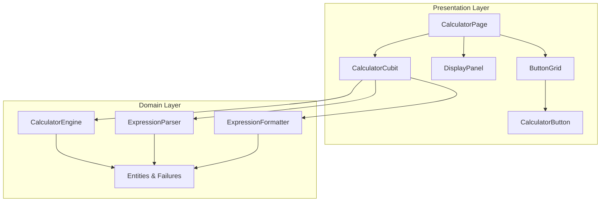
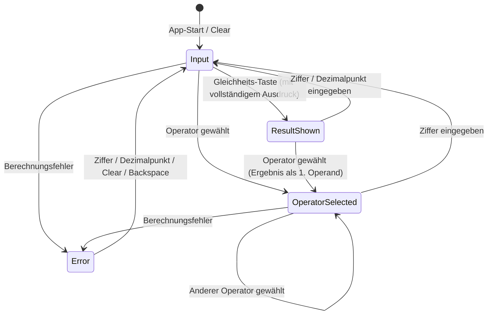

# Design-Dokument: Calculator App

## Übersicht

Dieses Design beschreibt die technische Umsetzung einer Taschenrechner-App als Flutter-Anwendung mit Clean Architecture. Die App ersetzt das bestehende Counter-Template und bietet grundlegende arithmetische Operationen (Addition, Subtraktion, Multiplikation, Division) mit einer responsiven Benutzeroberfläche.

Die Architektur folgt dem Prinzip der Schichtentrennung (Domain / Presentation) gemäß den Projekt-Steering-Vorgaben. Als State-Management-Lösung wird **Cubit (flutter_bloc)** eingesetzt, da es leichtgewichtig, testbar und für den Umfang dieser App ideal geeignet ist.

### Zentrale Design-Entscheidungen

| Entscheidung | Wahl | Begründung |
|---|---|---|
| State Management | Cubit (flutter_bloc) | Einfacher als Bloc für diesen Anwendungsfall, gute Testbarkeit, immutable States |
| Value Equality | Equatable | Leichtgewichtig, kein Code-Generator nötig (vs. freezed) |
| Dezimalzahlen | Dart `double` mit Rundungslogik | Ausreichend für 12-stellige Genauigkeit, kein externes Package nötig |
| Layout-Strategie | LayoutBuilder + OrientationBuilder | Native Flutter-Lösung für responsives Design |

## Architektur

Die App folgt der Clean Architecture mit zwei aktiven Schichten:



### Verzeichnisstruktur

```
lib/
├── main.dart
├── core/
│   ├── constants/
│   │   └── app_constants.dart
│   └── error/
│       └── failures.dart
└── features/
    └── calculator/
        ├── domain/
        │   ├── entities/
        │   │   ├── calculation_expression.dart
        │   │   └── operator_type.dart
        │   └── usecases/
        │       ├── calculator_engine.dart
        │       ├── expression_parser.dart
        │       └── expression_formatter.dart
        └── presentation/
            ├── cubit/
            │   ├── calculator_cubit.dart
            │   └── calculator_state.dart
            ├── pages/
            │   └── calculator_page.dart
            └── widgets/
                ├── calculator_button.dart
                ├── button_grid.dart
                └── display_panel.dart
```

### Dependency Rule

- **Presentation → Domain**: Widgets und Cubit dürfen Domain-Klassen importieren.
- **Domain → nichts**: Domain-Klassen haben keine Abhängigkeiten zu Flutter oder Presentation.
- **Kein Data-Layer**: Für diese App ist keine Persistenz oder externe Datenquelle erforderlich.

## Komponenten und Schnittstellen

### Domain Layer

#### OperatorType (Enum)

```dart
enum OperatorType {
  addition,      // +
  subtraction,   // −
  multiplication, // ×
  division,      // ÷
}
```

#### CalculationExpression (Entity)

```dart
class CalculationExpression extends Equatable {
  final double firstOperand;
  final OperatorType operator;
  final double secondOperand;

  const CalculationExpression({
    required this.firstOperand,
    required this.operator,
    required this.secondOperand,
  });

  @override
  List<Object?> get props => [firstOperand, operator, secondOperand];
}
```

#### CalculationFailure (Failure)

```dart
enum CalculationFailureType {
  divisionByZero,
  overflow,
}

class CalculationFailure extends Equatable {
  final CalculationFailureType type;

  const CalculationFailure(this.type);

  @override
  List<Object?> get props => [type];
}
```

#### ParseFailure (Failure)

```dart
enum ParseFailureType {
  missingOperand,
  missingOperator,
  invalidCharacter,
  operandTooLong,
}

class ParseFailure extends Equatable {
  final ParseFailureType type;

  const ParseFailure(this.type);

  @override
  List<Object?> get props => [type];
}
```

#### CalculatorEngine (Use Case)

```dart
/// Führt arithmetische Berechnungen durch.
/// Gibt Either<CalculationFailure, double> zurück.
class CalculatorEngine {
  /// Berechnet das Ergebnis einer CalculationExpression.
  Either<CalculationFailure, double> calculate(CalculationExpression expression);
}
```

Verhalten:
- Addition, Subtraktion, Multiplikation: direkte Berechnung
- Division: Prüfung auf Division durch Null → `CalculationFailure(divisionByZero)`
- Ergebnis außerhalb des Bereichs oder nicht endlich → `CalculationFailure(overflow)`

#### ExpressionParser (Use Case)

```dart
/// Wandelt eine formatierte Zeichenkette in eine CalculationExpression um.
class ExpressionParser {
  /// Parst einen String im Format "{Operand1} {Operator} {Operand2}".
  Either<ParseFailure, CalculationExpression> parse(String input);
}
```

#### ExpressionFormatter (Use Case)

```dart
/// Formatiert eine CalculationExpression in eine darstellbare Zeichenkette.
class ExpressionFormatter {
  /// Gibt einen String im Format "{Operand1} {Operator} {Operand2}" zurück.
  String format(CalculationExpression expression);
}
```

### Presentation Layer

#### CalculatorStatus (Enum)

```dart
enum CalculatorStatus {
  input,
  operatorSelected,
  resultShown,
  error,
}
```

#### CalculatorState (Immutable State)

```dart
class CalculatorState extends Equatable {
  final String currentInput;
  final OperatorType? selectedOperator;
  final double? firstOperand;
  final double? result;
  final CalculatorStatus status;

  const CalculatorState({
    this.currentInput = '0',
    this.selectedOperator,
    this.firstOperand,
    this.result,
    this.status = CalculatorStatus.input,
  });

  static const initial = CalculatorState();

  CalculatorState copyWith({...});

  @override
  List<Object?> get props => [currentInput, selectedOperator, firstOperand, result, status];
}
```

#### CalculatorCubit (State Management)

```dart
class CalculatorCubit extends Cubit<CalculatorState> {
  final CalculatorEngine _engine;

  CalculatorCubit(this._engine) : super(CalculatorState.initial);

  void inputDigit(String digit);
  void inputDecimalPoint();
  void selectOperator(OperatorType operator);
  void calculate();
  void clear();
  void backspace();
}
```

Zustandsübergänge:



#### CalculatorPage (Page)

Verantwortlich für:
- Layout-Entscheidung (Hoch-/Querformat) via `OrientationBuilder`
- Bereitstellung des `CalculatorCubit` via `BlocProvider`
- Zusammensetzung von `DisplayPanel` und `ButtonGrid`

#### DisplayPanel (Widget)

```dart
class DisplayPanel extends StatelessWidget {
  final String displayText;
  final String? expressionText;

  const DisplayPanel({
    required this.displayText,
    this.expressionText,
    super.key,
  });
}
```

#### ButtonGrid (Widget)

```dart
class ButtonGrid extends StatelessWidget {
  final void Function(String digit) onDigitPressed;
  final void Function() onDecimalPressed;
  final void Function(OperatorType operator) onOperatorPressed;
  final void Function() onEqualsPressed;
  final void Function() onClearPressed;
  final void Function() onBackspacePressed;
  final OperatorType? activeOperator;

  const ButtonGrid({...});
}
```

Layout: 4 Spalten, 5 Reihen:
```
| C    | ⌫    | ÷    | ×    |
| 7    | 8    | 9    | −    |
| 4    | 5    | 6    | +    |
| 1    | 2    | 3    | =    |
| 0 (doppelt)  | .    | =    |
```

#### CalculatorButton (Widget)

```dart
class CalculatorButton extends StatelessWidget {
  final String label;
  final Color backgroundColor;
  final VoidCallback onPressed;
  final bool isActive;
  final int flex;

  const CalculatorButton({
    required this.label,
    required this.backgroundColor,
    required this.onPressed,
    this.isActive = false,
    this.flex = 1,
    super.key,
  });
}
```

## Datenmodelle

### CalculationExpression

| Feld | Typ | Beschreibung |
|---|---|---|
| firstOperand | `double` | Erster Operand (Bereich: -999999999999 bis 999999999999) |
| operator | `OperatorType` | Arithmetischer Operator |
| secondOperand | `double` | Zweiter Operand (gleicher Bereich) |

### CalculatorState

| Feld | Typ | Initialwert | Beschreibung |
|---|---|---|---|
| currentInput | `String` | `'0'` | Aktuelle Benutzereingabe als Zeichenkette |
| selectedOperator | `OperatorType?` | `null` | Aktuell gewählter Operator |
| firstOperand | `double?` | `null` | Erster Operand (gespeichert nach Operator-Wahl) |
| result | `double?` | `null` | Letztes berechnetes Ergebnis |
| status | `CalculatorStatus` | `input` | Aktueller Zustand der App |

### Formatierungsregeln

- Maximal 12 sichtbare Ziffern (Dezimalpunkt und Minuszeichen zählen nicht)
- Keine führenden Nullen (außer bei Werten < 1, z.B. „0.5")
- Ergebnisse mit mehr als 12 Ziffern werden auf 12 signifikante Ziffern gerundet
- Trailing Zeros nach Dezimalpunkt werden bei Ergebnissen entfernt


## Korrektheitseigenschaften (Correctness Properties)

*Eine Korrektheitseigenschaft ist ein Verhalten, das für alle gültigen Ausführungen eines Systems gelten muss — eine formale Aussage darüber, was das System tun soll. Eigenschaften bilden die Brücke zwischen menschenlesbaren Spezifikationen und maschinell verifizierbaren Korrektheitsgarantien.*

### Property 1: Korrekte arithmetische Berechnung

*Für jede* gültige `CalculationExpression` mit Operanden im Bereich [-999999999999, 999999999999] und einem Operator aus {+, −, ×, ÷} (wobei bei Division der zweite Operand ≠ 0), soll das Ergebnis des `CalculatorEngine` dem mathematisch korrekten Ergebnis der Operation entsprechen.

**Validates: Requirements 1.1, 1.2**

### Property 2: Division durch Null ergibt Fehler

*Für jeden* gültigen ersten Operanden und den Operator Division mit zweitem Operanden = 0, soll der `CalculatorEngine` einen `CalculationFailure` vom Typ `divisionByZero` zurückgeben.

**Validates: Requirements 1.3**

### Property 3: Sequenzielle Auswertung ohne Operatorpräzedenz

*Für jede* Sequenz von mindestens zwei Operationen (Operand₁ Op₁ Operand₂ Op₂ Operand₃ ...), soll die Auswertung strikt von links nach rechts erfolgen: Zuerst wird Operand₁ Op₁ Operand₂ berechnet, dann das Zwischenergebnis Op₂ Operand₃, usw.

**Validates: Requirements 1.5, 1.6**

### Property 4: Fehlerzustand wird korrekt betreten und verlassen

*Für jeden* `CalculatorState`, wenn eine Berechnung einen `CalculationFailure` erzeugt, soll der resultierende Status `error` sein. *Für jeden* Zustand mit Status `error`, wenn eine Ziffer oder ein Dezimalpunkt eingegeben wird, soll der Status auf `input` wechseln und eine neue Berechnung beginnen.

**Validates: Requirements 1.7, 1.8**

### Property 5: Ergebnis als Operand oder neue Berechnung

*Für jeden* `CalculatorState` mit Status `resultShown` und einem Ergebnis R: Wenn ein Operator eingegeben wird, soll `firstOperand` den Wert R annehmen und der Status auf `operatorSelected` wechseln. Wenn eine Ziffer eingegeben wird, soll eine neue Berechnung mit dieser Ziffer beginnen (`firstOperand` = null, `currentInput` = eingegebene Ziffer).

**Validates: Requirements 1.9, 1.10**

### Property 6: Keine führenden Nullen bei Zifferneingabe

*Für jede* Sequenz von Zifferneingaben soll `currentInput` keine führenden Nullen enthalten, es sei denn der Wert ist „0" selbst oder beginnt mit „0." (Dezimalzahl < 1).

**Validates: Requirements 2.1, 2.2**

### Property 7: Dezimalpunkt-Invariante

*Für jede* beliebige Sequenz von Benutzereingaben (Ziffern und Dezimalpunkte) soll `currentInput` zu jedem Zeitpunkt maximal einen Dezimalpunkt enthalten.

**Validates: Requirements 2.4, 2.5**

### Property 8: Maximale Ziffernanzahl

*Für jede* beliebige Sequenz von Benutzereingaben soll die Anzahl der sichtbaren Ziffern in `currentInput` (ohne Dezimalpunkt und Minuszeichen) zu keinem Zeitpunkt 12 überschreiten. Ebenso soll jedes formatierte Ergebnis maximal 12 signifikante Ziffern enthalten.

**Validates: Requirements 2.6, 2.7, 2.9**

### Property 9: Clear setzt auf Initialzustand

*Für jeden* beliebigen `CalculatorState` soll nach Ausführung der Clear-Aktion der resultierende Zustand exakt dem definierten Initialzustand entsprechen (`currentInput` = „0", `selectedOperator` = null, `firstOperand` = null, `result` = null, `status` = input).

**Validates: Requirements 3.1**

### Property 10: Backspace entfernt letztes Zeichen

*Für jede* nicht-leere `currentInput` mit mehr als einem Zeichen soll nach Ausführung der Backspace-Aktion `currentInput` dem ursprünglichen String ohne das letzte Zeichen entsprechen. Wenn `currentInput` nur ein Zeichen enthält, soll das Ergebnis „0" sein.

**Validates: Requirements 3.2, 3.3**

### Property 11: State-Wertgleichheit

*Für jeden* `CalculatorState` S soll gelten: Ein zweiter `CalculatorState` mit identischen Feldwerten ist gleich S (S₁ == S₂ wenn alle Felder gleich sind). Außerdem soll `copyWith` eine neue Instanz erzeugen, ohne die Originalinstanz zu verändern.

**Validates: Requirements 5.1, 5.5**

### Property 12: Round-Trip Parser/Formatter

*Für jede* gültige `CalculationExpression` mit Operanden ≤ 12 sichtbare Ziffern soll gelten: Wenn die Expression formatiert und das Ergebnis erneut geparst wird, sind die Operandenwerte numerisch gleich und der Operator-Typ identisch zur ursprünglichen Struktur.

**Validates: Requirements 6.8**

### Property 13: Formatter-Invarianten

*Für jede* `CalculationExpression` soll die formatierte Ausgabe des `ExpressionFormatter` folgende Invarianten erfüllen: (a) keine führenden Nullen bei Operanden ≥ 1, (b) jeder Operand hat maximal 12 sichtbare Ziffern, (c) das Format ist „{Operand1} {Operator} {Operand2}".

**Validates: Requirements 6.5, 6.6, 6.7**

### Property 14: Parser erkennt ungültige Eingaben

*Für jede* ungültige Eingabe (fehlender Operand, fehlender Operator, ungültiges Zeichen, Operand mit > 12 Ziffern) soll der `ExpressionParser` einen `ParseFailure` mit dem korrekten Fehlertyp zurückgeben.

**Validates: Requirements 6.3**

### Property 15: Operator-Ersetzung

*Für jeden* `CalculatorState` mit Status `operatorSelected` und einem aktiven Operator Op₁, wenn ein neuer Operator Op₂ eingegeben wird, soll `selectedOperator` den Wert Op₂ annehmen und der Status `operatorSelected` bleiben. Der `firstOperand` bleibt unverändert.

**Validates: Requirements 9.1**

## Fehlerbehandlung

### Domain-Fehler

| Fehlertyp | Auslöser | Verhalten |
|---|---|---|
| `CalculationFailure(divisionByZero)` | Division mit zweitem Operand = 0 | Status → `error`, Display zeigt „Fehler" |
| `CalculationFailure(overflow)` | Ergebnis nicht endlich oder außerhalb des Bereichs | Status → `error`, Display zeigt „Fehler" |
| `ParseFailure(missingOperand)` | Ausdruck ohne Operand | Interner Fehler, sollte durch UI-Logik verhindert werden |
| `ParseFailure(missingOperator)` | Ausdruck ohne Operator | Interner Fehler, sollte durch UI-Logik verhindert werden |
| `ParseFailure(invalidCharacter)` | Ungültiges Zeichen im Ausdruck | Interner Fehler, sollte durch UI-Logik verhindert werden |
| `ParseFailure(operandTooLong)` | Operand mit > 12 Ziffern | Interner Fehler, wird durch Eingabebegrenzung verhindert |

### Fehler-Recovery

- **Aus Fehlerzustand**: Jede Ziffern-, Dezimalpunkt- oder Clear-Eingabe setzt den Fehlerzustand zurück
- **Backspace im Fehlerzustand**: Setzt auf Initialzustand zurück (wie Clear)
- **Kein App-Absturz**: Alle Berechnungsfehler werden als `CalculationFailure` behandelt, nie als unbehandelte Exceptions

### Either-Pattern

Die Domain-Schicht verwendet das Either-Pattern (z.B. via `dartz` oder eigene Implementierung) für Fehlerbehandlung:

```dart
// Erfolg oder Fehler, ohne Exceptions
Either<CalculationFailure, double> calculate(CalculationExpression expr);
Either<ParseFailure, CalculationExpression> parse(String input);
```

Dies ermöglicht:
- Explizite Fehlerbehandlung im Cubit
- Keine unbehandelten Exceptions
- Typsichere Fehler-Propagation

## Teststrategie

### Dualer Testansatz

Die Teststrategie kombiniert zwei komplementäre Ansätze:

1. **Property-Based Tests**: Verifizieren universelle Eigenschaften über viele generierte Eingaben (min. 100 Iterationen pro Property)
2. **Unit/Widget Tests**: Verifizieren spezifische Beispiele, Randfälle und UI-Verhalten

### Property-Based Testing

**Bibliothek**: [`glados`](https://pub.dev/packages/glados) (Dart Property-Based Testing Library)

**Konfiguration**:
- Minimum 100 Iterationen pro Property-Test
- Jeder Test referenziert die zugehörige Design-Property
- Tag-Format: `Feature: calculator-app, Property {number}: {property_text}`

**Abgedeckte Properties**:

| Property | Getestete Komponente | Muster |
|---|---|---|
| 1: Korrekte Berechnung | CalculatorEngine | Metamorphisch (Vergleich mit Referenz) |
| 2: Division durch Null | CalculatorEngine | Fehlerbedingung |
| 3: Sequenzielle Auswertung | CalculatorCubit | Invariante |
| 4: Fehlerzustand-Übergänge | CalculatorCubit | Zustandsmaschine |
| 5: Ergebnis als Operand | CalculatorCubit | Zustandsmaschine |
| 6: Keine führenden Nullen | CalculatorCubit | Invariante |
| 7: Dezimalpunkt-Invariante | CalculatorCubit | Invariante |
| 8: Max. Ziffernanzahl | CalculatorCubit + Formatter | Invariante |
| 9: Clear → Initialzustand | CalculatorCubit | Idempotenz |
| 10: Backspace | CalculatorCubit | Metamorphisch |
| 11: State-Wertgleichheit | CalculatorState | Reflexivität |
| 12: Round-Trip | Parser + Formatter | Round-Trip |
| 13: Formatter-Invarianten | ExpressionFormatter | Invariante |
| 14: Parser-Fehler | ExpressionParser | Fehlerbedingung |
| 15: Operator-Ersetzung | CalculatorCubit | Zustandsmaschine |

### Unit Tests (Beispiel-basiert)

| Bereich | Testfälle |
|---|---|
| CalculatorEngine | Konkrete Berechnungen (2+3=5, 10÷2=5, etc.) |
| ExpressionParser | Spezifische Fehlertypen (je ein Beispiel pro ParseFailureType) |
| ExpressionFormatter | Formatierung mit führenden Nullen, Rundung |
| CalculatorCubit | Spezifische Zustandsübergänge (Equals ohne Operator, Dezimalpunkt nach Ergebnis) |

### Widget Tests

| Widget | Testfälle |
|---|---|
| CalculatorButton | Instanziierung, Tap-Callback, visuelle Zustände |
| DisplayPanel | Anzeige von Eingabe, Ausdruck, Fehlertext |
| ButtonGrid | Vollständigkeit der Tasten, 4-Spalten-Layout |
| CalculatorPage | Hochformat-Layout, Querformat-Layout, Responsivität |

### Testverzeichnisstruktur

```
test/
├── core/
│   └── error/
│       └── failures_test.dart
└── features/
    └── calculator/
        ├── domain/
        │   ├── entities/
        │   │   └── calculation_expression_test.dart
        │   └── usecases/
        │       ├── calculator_engine_test.dart
        │       ├── calculator_engine_property_test.dart
        │       ├── expression_parser_test.dart
        │       ├── expression_parser_property_test.dart
        │       ├── expression_formatter_test.dart
        │       └── expression_formatter_property_test.dart
        └── presentation/
            ├── cubit/
            │   ├── calculator_cubit_test.dart
            │   ├── calculator_cubit_property_test.dart
            │   └── calculator_state_test.dart
            ├── pages/
            │   └── calculator_page_test.dart
            └── widgets/
                ├── calculator_button_test.dart
                ├── button_grid_test.dart
                └── display_panel_test.dart
```

### Abhängigkeiten für Tests

```yaml
dev_dependencies:
  flutter_test:
    sdk: flutter
  glados: ^1.1.1          # Property-Based Testing
  bloc_test: ^9.1.0       # Cubit/Bloc Testing Utilities
  mocktail: ^1.0.0        # Mocking
```

### Produktions-Abhängigkeiten

```yaml
dependencies:
  flutter:
    sdk: flutter
  flutter_bloc: ^8.1.0    # Cubit State Management
  equatable: ^2.0.5       # Value Equality
  dartz: ^0.10.1          # Either-Type für Fehlerbehandlung
```
